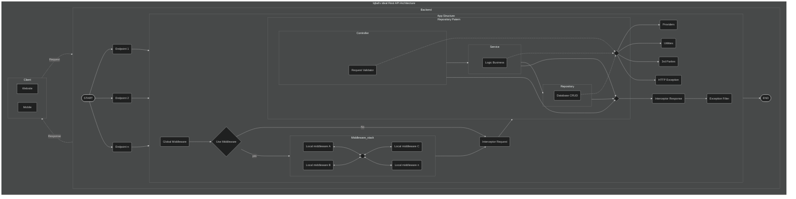

# Ideal-rest-API-architecture

```mermaid
%%{init: { 'theme': 'dark' } }%%
flowchart LR
  subgraph Iqbal's ideal Rest API Architecture
    direction LR
    subgraph Client
        direction LR
        Website
        Mobile
    end
    Client -.-> |Request| Backend
    Backend -.-> |Response| Client
    subgraph Backend
      direction LR
      Endpoint_fork_handler([START])
      Endpoint_fork_handler --> E1(Endpoint 1) & E2(Endpoint 2) & En(Endpoint n) --> App_structure

      subgraph App_structure["App Structure"]
        direction LR

        LMA(Local middleware A)
        LMB(Local middleware B)
        LMC(Local middleware C)
        LMn(Local middleware n)
        Intercep_req(Interceptor Request)
        use_middleware{Use Middleware}
        GM(Global Middleware) --> use_middleware -->|yes| Middleware_stack --> Intercep_req --> Repository_Pattern
        use_middleware -->|No| Intercep_req

        subgraph Middleware_stack
          direction LR
          LMA & LMB <--> middleware_join{ } <--> LMC & LMn
        end
        subgraph Repository_Pattern["Repository Patern"]
          subgraph Controller
            RV(Request Validator)
          end
          Controller --> Service

          subgraph Service
            LB(Logic Business)
          end
          Service --> Repository

          subgraph Repository
            Dcrud(Database CRUD)
          end

          Repository_pattern_join_handler{ }
          RV -.-> Repository_pattern_join_handler
          LB -.-> Repository_pattern_join_handler
          Dcrud -.-> Repository_pattern_join_handler

          Repository_pattern_join_handler_2{ }
          Controller --> Repository_pattern_join_handler_2
          Service --> Repository_pattern_join_handler_2
          Repository --> Repository_pattern_join_handler_2
        end
        Repository_pattern_join_handler --> Provider(Providers)
        Repository_pattern_join_handler --> Util(Utilities)
        Repository_pattern_join_handler --> 3rd_party(3rd Parties)
        Repository_pattern_join_handler --> HttpException(HTTP Exception)

        Repository_pattern_join_handler_2 --> Intercep_res(Interceptor Response)
        Intercep_res --> ExceptionFilter(Exception Filter)
      end
      App_structure --> server_response([END])
    end
  end
```
